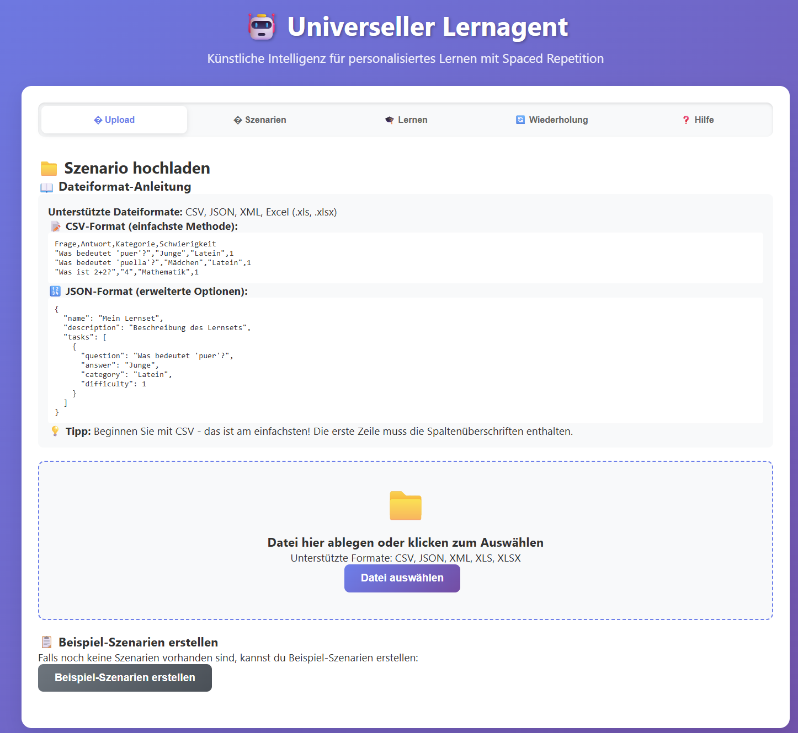
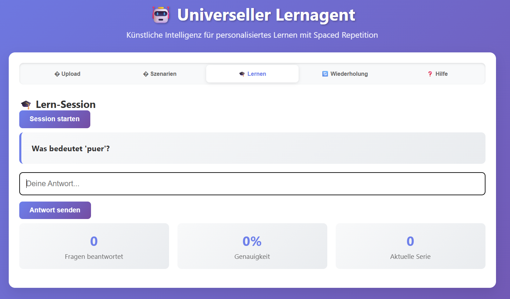
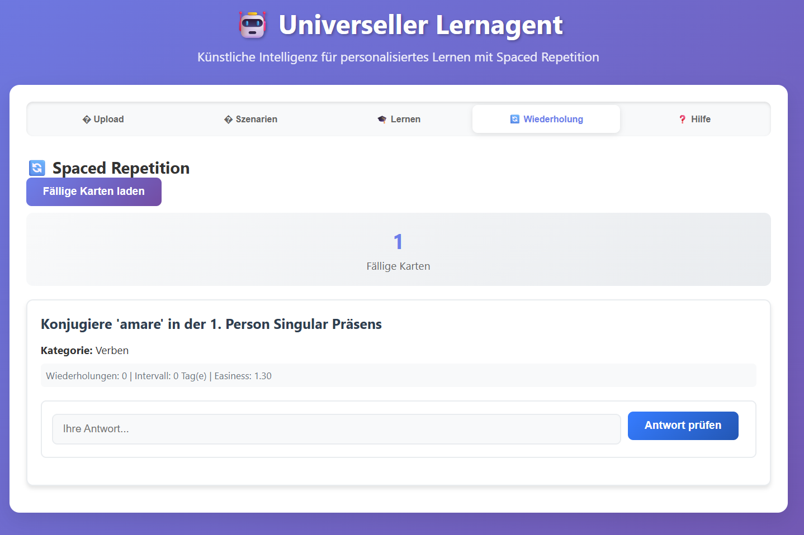
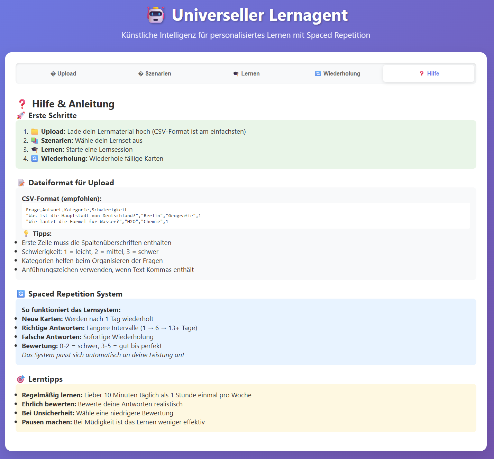
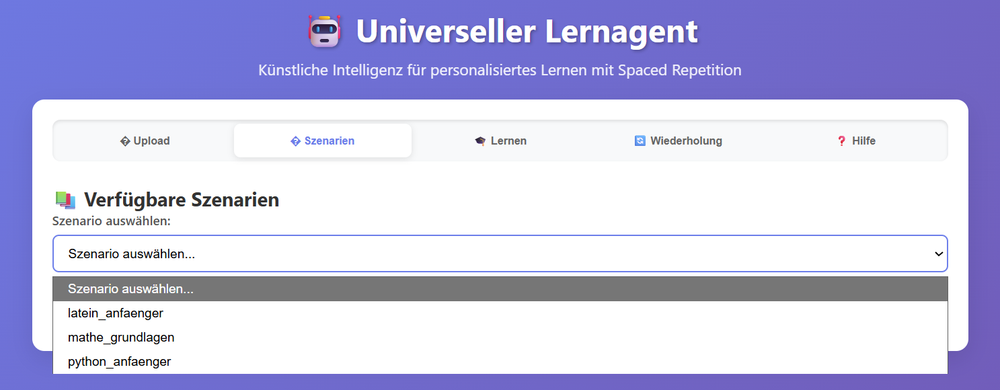

# Universeller Lernagent

Ein kinderfreundlicher Lernassistent mit Spaced Repetition System, der Reinforcement Learning verwendet, um sich an den individuellen Lernfortschritt anzupassen.

## 📸 Screenshots

<table>
<tr>
<td width="50%">

<p align="center"><strong>Upload & Import</strong></p>
</td>
<td width="50%">

<p align="center"><strong>Lern-Session</strong></p>
</td>
</tr>
<tr>
<td width="50%">

<p align="center"><strong>Spaced Repetition</strong></p>
</td>
<td width="50%">

<p align="center"><strong>Hilfe & Anleitung</strong></p>
</td>
</tr>
</table>

## 🎯 Kernkonzept

Dieser Lernagent implementiert ein universelles Framework für verschiedene Lernszenarien. Das System:
- Passt sich dynamisch an den Lernfortschritt an
- Verwendet Spaced Repetition für optimales Langzeitlernen
- Wählt optimale Aufgaben basierend auf dem aktuellen Wissensstand
- Gibt gezielte Hinweise und Feedback
- Optimiert die Lerngeschwindigkeit durch intelligente Schwierigkeitsanpassung

## 🏗️ Architektur

### Komponenten
1. **Lernszenarien**: Modulare Definition von Lerninhalten (CSV/JSON/XML-Import)
2. **Spaced Repetition System**: SM-2 Algorithmus für optimale Wiederholung
3. **RL-Agent**: Trainierter Agent mit DQN/A2C/PPO Algorithmen (automatisch)
4. **FastAPI Backend**: REST-API für alle Lernfunktionen
5. **Web-Interface**: Modernes HTML/JavaScript Frontend
6. **Szenario-Manager**: Import und Verwaltung von Lernszenarien

### Unterstützte Lernszenarien
- **Latein**: Vokabeln und Grammatik für Anfänger
- **Python**: Programmierung Grundlagen
- **Mathematik**: Grundrechenarten und Algebra
- **Eigene Inhalte**: CSV/JSON/XML Import-Unterstützung

## 🚀 Installation und Setup

### Voraussetzungen
- Python >= 3.11
- uv Package Manager (empfohlen) oder pip

### Installation
```bash
# Clone/Download das Projekt
cd learning_agent

# Virtuelle Umgebung aktivieren (Windows PowerShell)
.venv\Scripts\activate

# Abhängigkeiten installieren
uv sync
```

## 📖 Verwendung

### Web-Interface (Empfohlen)
```bash
# Einfachster Start - öffnet automatisch das Web-Interface
python main.py

# Oder explizit das Web-Interface starten
python main.py --web

# Oder direkt die API starten
python -m src.learning_agent.api
```
Das Web-Interface öffnet sich automatisch im Browser unter `http://localhost:8001`

### CLI-Funktionen (Erweitert)
```bash
# Beispiel-Szenarien erstellen
python main.py --create-scenarios

# Verfügbare Szenarien anzeigen
python main.py --list-scenarios

# Agent trainieren (für Entwickler)
python main.py --train latein_anfaenger --algorithm DQN --timesteps 10000
```

### 🐳 Docker (Containerisiert)
```bash
# Mit Docker Compose (empfohlen)
docker-compose up -d

# Oder manuell mit Docker
docker build -t learning-agent .
docker run -p 8001:8001 -v ./models:/app/models -v ./scenarios:/app/scenarios learning-agent
```

### 🚀 GPU-Unterstützung (für Training)
```bash
# GPU-Version mit Docker Compose
docker-compose --profile gpu up -d
```

## 🎮 Web-Interface Funktionen


### 1. Upload & Import
- **Datei-Upload**: CSV, JSON, XML, Excel-Dateien
- **Format-Anleitung**: Integrierte Hilfe für korrekte Dateiformate
- **Automatisches Training**: System wird nach Upload automatisch vorbereitet
- **Beispiel-Szenarien**: Vorgefertigte Lernsets zum Ausprobieren



### 2. Szenario-Auswahl
- Anzeige aller verfügbaren Lernszenarien
- Detaillierte Informationen zu jedem Szenario
- Einfache Auswahl für sofortigen Start


### 3. Lern-Session
- Interaktive Lernsessions mit Frage-Antwort-System
- Echtzeit-Anpassung der Schwierigkeit
- Fortschrittsverfolgung und Statistiken
- Anti-Cheat-System für ehrliches Lernen


### 4. Spaced Repetition
- **SM-2 Algorithmus**: Wissenschaftlich bewährtes Wiederholungssystem
- **Intelligente Terminierung**: Karten werden optimal zeitlich verteilt
- **Qualitätsbewertung**: 6-stufiges Bewertungssystem (0-5)
- **Fortschrittsanzeige**: Klare Rückmeldung über Wiederholungsintervalle


### 5. Hilfe & Anleitung
- **Erste Schritte**: Schritt-für-Schritt Anleitung
- **Dateiformat-Hilfe**: Detaillierte Erklärungen für Import-Formate
- **Spaced Repetition Erklärung**: Wie das Lernsystem funktioniert
- **Lerntipps**: Pädagogisch wertvolle Hinweise

## 🧠 Spaced Repetition Details

### SM-2 Algorithmus
Das System verwendet den bewährten SM-2 (SuperMemo 2) Algorithmus:
- **Neue Karten**: Erste Wiederholung nach 1 Tag
- **Erfolgreiche Karten**: Intervalle steigen (1 → 6 → 13+ Tage)
- **Schwierige Karten**: Sofortige Wiederholung bei Fehlern
- **Anpassung**: Einfachheitsfaktor passt sich an Leistung an

### Bewertungssystem
- **0 - Blackout**: Kompletter Blackout
- **1 - Sehr schwer**: Inkorrekt, aber erinnert
- **2 - Schwer**: Korrekt mit großer Schwierigkeit
- **3 - Normal**: Korrekt mit etwas Schwierigkeit
- **4 - Leicht**: Korrekt ohne Schwierigkeit
- **5 - Perfekt**: Perfekt und schnell

## 🧠 Reinforcement Learning Details

### Automatisches Training
Das System trainiert sich automatisch beim Upload neuer Szenarien:
- **Robustes Training**: Mehrere Versuche mit steigender Intensität
- **Qualitätskontrolle**: Mindest-Performance-Threshold
- **Transparenz**: Benutzer sehen nur "System bereit" - keine technischen Details

### State (Zustand des Lernenden)
- Erfolgsraten pro Kategorie
- Durchschnittliche Antwortzeiten
- Anzahl verwendeter Hinweise
- Aufeinanderfolgende richtige/falsche Antworten
- Geschätzte Fähigkeiten (Item Response Theory)

### Actions (Agent-Aktionen)
- Aufgabe mit spezifischer Schwierigkeit stellen
- Hinweis geben
- Feedback bereitstellen
- Schwierigkeit anpassen

### Reward (Belohnung)
- +1.0 für richtige Antworten
- +0.5 Bonus für optimale Erfolgsrate (70-80%)
- +0.2 Bonus für schnelle Antworten
- -0.5 für falsche Antworten
- -0.1 für Hinweise
- Zusätzliche Strafen/Boni basierend auf Lernfortschritt

### Algorithmen
- **DQN**: Deep Q-Network (Standard)
- **A2C**: Advantage Actor-Critic
- **PPO**: Proximal Policy Optimization

## 📁 Projektstruktur

```
learning_agent/
├── main.py                          # Haupteinstiegspunkt (CLI + Web-Interface)
├── pyproject.toml                   # Projekt-Konfiguration
├── docker-compose.yml               # Docker-Konfiguration
├── docker-entrypoint.sh             # Container-Start-Skript
├── src/learning_agent/              # Hauptcode
│   ├── __init__.py
│   ├── api.py                      # FastAPI Server
│   ├── models.py                   # Datenmodelle (Pydantic)
│   ├── environment.py              # Gymnasium-Umgebung
│   ├── agent.py                    # RL-Agent (Stable Baselines3)
│   ├── scenario_manager.py         # Szenario-Verwaltung
│   ├── scenario_importer.py        # Multi-Format Import (CSV/JSON/XML)
│   ├── spaced_repetition.py        # SM-2 Spaced Repetition System
│   ├── auto_training.py           # Automatisches Training-Management
│   ├── ui.py                      # Legacy Streamlit Interface
│   └── static/
│       └── index.html             # Modernes Web-Frontend
├── scenarios/                      # JSON-Szenario-Dateien
├── models/                        # Trainierte RL-Modelle
└── data/                         # Lernfortschritt-Daten
    └── spaced_repetition/        # Spaced Repetition Karten-Datenbank
```

## 🔧 Eigene Szenarien erstellen

### CSV-Format (Empfohlen)
```csv
Frage,Antwort,Kategorie,Schwierigkeit
"Was bedeutet 'puer'?","Junge","Latein",1
"Was bedeutet 'puella'?","Mädchen","Latein",1
"Was ist 2+2?","4","Mathematik",1
```

### JSON-Format (Erweitert)
```json
{
  "name": "mein_szenario",
  "description": "Beschreibung des Lernszenarios",
  "version": "1.0",
  "categories": ["Kategorie1", "Kategorie2"],
  "tasks": [
    {
      "id": "task_001",
      "question": "Frage?",
      "answer": "Antwort",
      "task_type": "free_text",
      "difficulty": 1,
      "category": "Kategorie1",
      "hints": ["Hinweis 1", "Hinweis 2"]
    }
  ]
}
```

### XML-Format
```xml
<?xml version="1.0" encoding="UTF-8"?>
<scenario>
    <name>mein_szenario</name>
    <description>Beschreibung</description>
    <tasks>
        <task>
            <question>Frage?</question>
            <answer>Antwort</answer>
            <category>Kategorie1</category>
            <difficulty>1</difficulty>
        </task>
    </tasks>
</scenario>
```

### Task-Typen
- `free_text`: Freitext-Antwort
- `multiple_choice`: Multiple Choice
- `translation`: Übersetzung
- `code_completion`: Code-Vervollständigung
- `fill_in_blank`: Lückentext

### Schwierigkeitsgrade
- `1`: Anfänger
- `2`: Fortgeschritten
- `3`: Experte
- `4`: Meister

## 🎯 Training-Tipps

### Optimale Parameter (automatisch konfiguriert)
- **DQN**: Gut für diskrete Aktionen, stabil
- **A2C**: Schneller als DQN, weniger Speicher
- **PPO**: Beste Balance zwischen Performance und Stabilität

### Training Duration (automatisch optimiert)
- **Einfache Szenarien**: 10,000+ Timesteps
- **Komplexe Szenarien**: 20,000-30,000 Timesteps
- **Robustes System**: Mehrere Versuche bis Erfolg

## 🔍 API Endpunkte

### Hauptendpunkte
- `GET /`: Web-Interface
- `GET /api/scenarios`: Verfügbare Szenarien
- `POST /api/upload-scenario`: Szenario-Upload
- `POST /api/load-scenario`: Szenario laden
- `POST /api/start-session`: Lernsession starten
- `POST /api/submit-answer`: Antwort einreichen
- `GET /api/spaced-repetition/due`: Fällige Wiederholungen
- `POST /api/spaced-repetition/check-answer/{card_id}`: Antwort prüfen
- `POST /api/spaced-repetition/review`: Wiederholung bewerten
- `GET /api/health`: Gesundheitscheck

## 🔍 Troubleshooting

### Häufige Probleme
1. **"Lädt Szenarien..."**: Server neu starten oder Beispiel-Szenarien erstellen
2. **"Szenario nicht gefunden"**: Erstelle Beispiel-Szenarien über Upload-Tab
3. **Upload-Fehler**: Prüfe Dateiformat entsprechend der Anleitung im Hilfe-Tab
4. **Training-Probleme**: System trainiert automatisch - bei Problemen Server neu starten

### Performance-Optimierung
- Verwende CSV-Format für einfachste Uploads
- Nutze Docker für isolierte Umgebung
- GPU-Unterstützung für große Datensätze

## 🤝 Erweiterungen

### Neue Algorithmen hinzufügen
1. Erweitere `LearningAgent.create_model()`
2. Füge neuen Algorithmus zu den Optionen hinzu
3. Teste mit verschiedenen Szenarien

### Neue Import-Formate
1. Erweitere `ScenarioImporter` in `scenario_importer.py`
2. Implementiere neue Parser-Methoden
3. Teste Import-Funktionalität

### Integration von externen APIs
- Sprachmodelle für Feedback-Generierung
- Text-to-Speech für Audio-Feedback
- Adaptive Testing Algorithmen

## 📊 Metriken und Evaluation

### Spaced Repetition Metriken
- Retention Rate (Behaltensrate)
- Review Accuracy (Wiederholungsgenauigkeit)
- Optimal Interval Adherence (Intervalltreue)
- Learning Velocity (Lerngeschwindigkeit)

### Agent-Performance
- Episode Rewards
- Convergence Rate
- Final Success Rate

### Lerner-Performance  
- Accuracy over Time
- Learning Velocity
- Long-term Retention


## 👨‍👩‍👧‍👦 Einfachheit

Das System wurde speziell für eine einfache Nutzung, auch durch Kinder, optimiert:
- **Einfache Navigation**: Nur wesentliche Funktionen sichtbar
- **Klare Anweisungen**: Schritt-für-Schritt Führung
- **Automatische Prozesse**: Kein manuelles Training erforderlich
- **Verständliche Rückmeldungen**: Keine technischen Fehlermeldungen
- **Sichere Umgebung**: Lokale Ausführung, keine Internetverbindung nötig

## 📄 Lizenz

AGPLv3 License - siehe LICENSE.md

